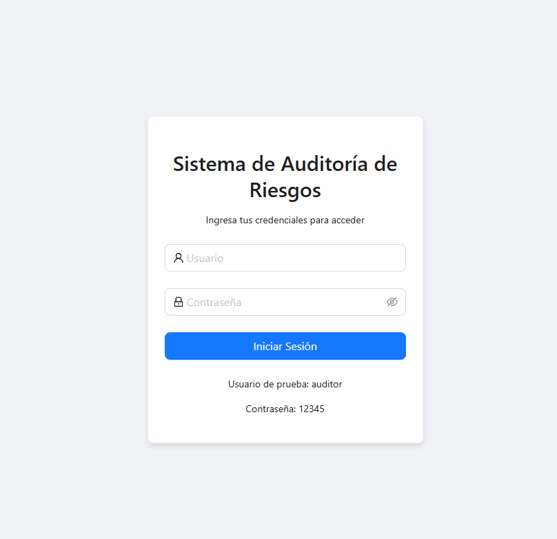

# Informe de Auditoría de Sistemas - Examen de la Unidad I

**Nombres y apellidos:**
Albert Kenyi Apaza Ccalle

**Código Universitario:**
2021071075

**Fecha:**
10/09/2025

**URL GitHub:**
https://github.com/AlbertApaza/EXAUI-AUDITORIA

---

## 1. Proyecto de Auditoría de Riesgos

### Login

**Evidencia:**

**Descripción:**

*Se implementó una funcionalidad de inicio de sesión ficticia sin conexión a base de datos. El sistema valida un usuario y contraseña predefinidos en el código fuente. Si las credenciales son correctas, el usuario es redirigido al panel principal de la herramienta de auditoría.*

### Motor de Inteligencia Artificial

**Evidencia:**

**Descripción:**

*El motor de IA fue mejorado para interactuar con un modelo de lenguaje avanzado ejecutado localmente. La función principal recibe el nombre y tipo de un activo de información, procesa esta entrada y genera automáticamente un análisis que incluye perfiles de riesgo, impacto potencial y recomendaciones de mitigación alineadas con los controles de la norma ISO 27001. Este fragmento de código es el responsable de gestionar la comunicación con el modelo y formatear la respuesta para el usuario.*

---

## 2. Hallazgos

### Activo 1: Servidor de base de datos

**Evidencia:**

**Condición:**

*Durante la evaluación, se constató que el servidor de base de datos que almacena información de clientes no tiene habilitado el cifrado de datos en reposo (TDE - Transparent Data Encryption). Esto expone la información a accesos no autorizados en caso de una brecha de seguridad física o un acceso indebido a los archivos de la base de datos.*

**Recomendación:**

*Se recomienda habilitar de forma inmediata el cifrado TDE en todas las bases de datos que contengan información sensible. Adicionalmente, se debe reforzar el control de acceso físico a los servidores y auditar regularmente los permisos de acceso a los archivos de la base de datos.*

**Riesgo:**
*   **Probabilidad:** Alta

---

### Activo 2: API Transacciones

**Evidencia:**

**Condición:**

*La API utilizada para las transacciones bancarias no implementa un mecanismo de limitación de tasa (rate limiting). Esta ausencia la hace vulnerable a ataques de Denegación de Servicio (DoS) a través de la inundación de peticiones, así como a ataques de fuerza bruta para la enumeración de datos de usuarios o transacciones.*

**Recomendación:**

*Implementar una política de limitación de tasa en el API Gateway. Se sugiere limitar el número de peticiones por IP o por token de usuario a un umbral razonable (ej. 100 peticiones por minuto) para mitigar el riesgo de abuso y garantizar la disponibilidad del servicio.*

**Riesgo:**
*   **Probabilidad:** Media

---

### Activo 3: Aplicación Web de Banca

**Evidencia:**

**Condición:**

*Se ha identificado que los encabezados de seguridad HTTP (como Content-Security-Policy, Strict-Transport-Security y X-Frame-Options) no están configurados correctamente en la aplicación web de la banca. Esta omisión aumenta la exposición a ataques de tipo Cross-Site Scripting (XSS), clickjacking y Man-in-the-Middle.*

**Recomendación:**

*Configurar y reforzar los encabezados de seguridad HTTP en el servidor web. Es crucial implementar una política de seguridad de contenido (CSP) estricta, forzar el uso de HTTPS con HSTS y prevenir que el sitio sea cargado en iframes de dominios no autorizados mediante X-Frame-Options.*

**Riesgo:**
*   **Probabilidad:** Alta

---

### Activo 4: Servidor de Correo

**Evidencia:**

**Condición:**

*El servidor de correo corporativo no tiene implementados los protocolos de autenticación de correo electrónico DMARC, DKIM y SPF. Esta carencia facilita que actores maliciosos puedan suplantar la identidad del dominio del banco (spoofing) para realizar ataques de phishing dirigidos a clientes y empleados.*

**Recomendación:**

*Configurar los registros SPF, DKIM y DMARC en el DNS del dominio del banco. Se debe iniciar con una política DMARC de "none" para monitorear, y progresivamente ajustarla a "quarantine" y finalmente a "reject" para bloquear activamente los correos no autenticados.*

**Riesgo:**
*   **Probabilidad:** Media

---

### Activo 5: Firewall Perimetral

**Evidencia:**

**Condición:**

*La revisión de las reglas del firewall perimetral reveló la existencia de reglas obsoletas y excesivamente permisivas (ej. "any-any"). Específicamente, se encontraron puertos abiertos para servicios que fueron descontinuados, lo cual incrementa la superficie de ataque de la red interna sin ninguna justificación operativa.*

**Recomendación:**

*Realizar una auditoría exhaustiva y periódica (trimestral) de todas las reglas del firewall. Se debe implementar una política de "denegación por defecto" y eliminar todas las reglas que no estén asociadas a un requerimiento de negocio vigente y documentado.*

**Riesgo:**
*   **Probabilidad:** Baja
