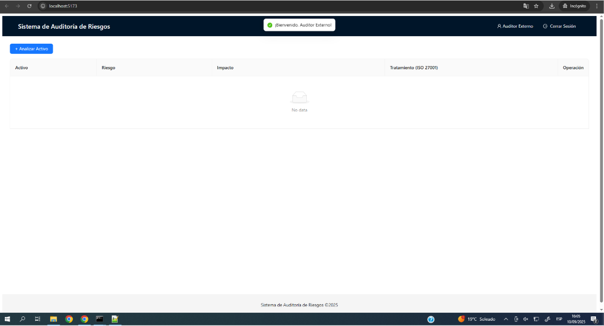

# Informe de Auditoría de Sistemas - Examen de la Unidad I

**Nombres y apellidos:**
Albert Kenyi Apaza Ccalle

**Código Universitario:**
2021071075

**Fecha:**
10/09/2025

**URL GitHub:**
https://github.com/AlbertApaza/EXAUI-AUDITORIA

---
# Informe de Auditoría de Sistemas - Examen de la Unidad I

**Nombres y apellidos:**  
**Fecha:**  
**URL GitHub:**  

---

## 1. Proyecto de Auditoría de Riesgos

### Login
**Evidencia:**  
  
  

**Descripción:**  
El inicio de sesión es ficticio y se realiza completamente en el frontend, sin conexión a un servidor ni base de datos. La validación ocurre en la función onFinish del formulario de React, comparando los valores ingresados con credenciales predefinidas (usuario: "auditor" y contraseña: "12345"). Si coinciden, se considera un login exitoso y se llama a onLoginSuccess; si no, se muestra un mensaje de error. Esto permite probar la funcionalidad de acceso sin necesidad de un backend real.

### Motor de Inteligencia Artificial
**Evidencia:**  
  

**Descripción:**  
Este modelo implementa una API en Flask que permite analizar riesgos de activos tecnológicos y sugerir tratamientos según la norma ISO 27000, usando un modelo de inteligencia artificial (llama3) para generar automáticamente listas de riesgos e impactos asociados a un activo y proponer medidas correctivas o preventivas en base a la información proporcionada por el usuario.

---

## 2. Hallazgos

### Activo 1: Servidor de base de datos
**Evidencia:**  
  

**Riesgo:**  
Acceso no autorizado
**Impacto	:**  
terceros pueden acceder a los datos almacenados en el servidor de bases de datos sin permiso, lo que podría llevar a la revelación de información confidencial y daño a la reputación de la organización

**Tratamiento (ISO 27001)	:**  
Implementar autenticación multisecuencia y utilizar credenciales fuertes para controlar acceso a los datos; limitar el acceso solo a aquellos que sean necesarios y autorizados.

### Activo 2: API Transacciones
**Evidencia:**  
  
**Riesgo:**  
Inseguridad en la autenticación y autorización
**Impacto	:**  
la API no verifica adecuadamente la identidad de los usuarios y permite transacciones no autorizadas, lo que puede llevar a la pérdida o alteración de datos confidenciales

**Tratamiento (ISO 27001)	:**  
Implementar Autenticación JWT (JSON Web Token) con validación en ambos extremos (servidor y cliente), para asegurar la autenticidad y autorización de las transacciones.

### Activo 3: Aplicación Web de Banca 
**Evidencia:**  
  
**Riesgo:**  
Ataque de Inyección de Script
**Impacto	:**  
un atacante ingiere código malintencionado en la aplicación web para obtener acceso indebidamente a las cuentas bancarias y comprometer los datos personales y financieros

**Tratamiento (ISO 27001)	:**  
Implementar una validación de entrada robusta para prevenir la inyección de script y realizar análisis estáticos de seguridad regularmente en el código fuente de la aplicación web.

### Activo 4: Servidor de Correo
**Evidencia:**  
  

**Riesgo:**  
Acceso no autorizado
**Impacto	:**  
terceros pueden acceder a correos electrónicos o información almacenada en el servidor de correo electrónico sin permiso, lo que podría llevar a la revelación de datos confidenciales
**Tratamiento (ISO 27001)	:**  
Implementar autenticación y autorización robusta para acceso al servidor, utilizando medidas de seguridad como autenticación multifactorial y monitorización de actividad irregular.

### Activo 5: Firewall Perimetral

**Evidencia:**  
  

**Riesgo:**  
Fallos en el mantenimiento
**Impacto	:**  
es posible que el firewall perimetral no esté correctamente configurado o actualizado, lo que deja brechas en la seguridad y permite accesos no autorizados a la red
**Tratamiento (ISO 27001)	:**  
Realizar un análisis de vulnerabilidades y implementar un plan de actualización y pruebas para asegurarse del correcto funcionamiento del firewall perimetral.